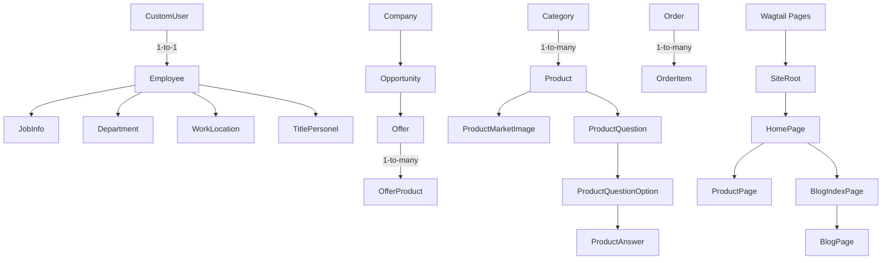

# LiftKeys Proje Kılavuzu & Durum Raporu (GEMINI.md)

Bu dosya, LiftKeys projesinin mimarisini, veri modellerini, geliştirme standartlarını, yapılandırma detaylarını, mevcut durumunu ve tespit edilen eksiklikleri (teknik borçları) sonraki oturumlarda projeyi devralacak yapay zeka asistanları (ve geliştiriciler) için özetler.

---

## 1. Proje Genel Bakışı & Teknolojiler
LiftKeys, asansör bileşenleri ve yedek parçaları için geliştirilmiş B2B e-ticaret ve CRM platformudur.

- **Backend / Framework:** Django 5.2.4 + Wagtail 7.1.1 (CMS)
- **Veritabanı:** MySQL 8.0 (Canlı ortamda ve yerel geliştirmede hedeflenen veritabanı)
- **Arayüz (Frontend):** Bootstrap 5, django-crispy-forms, crispy-bootstrap5, widget-tweaks
- **Çeviri Katmanları (7 Dil Desteği):**
  1. **Arayüz Metinleri (UI):** Django i18n (`locale/` klasöründeki `.po` dosyaları) + Rosetta çeviri paneli.
  2. **Dinamik Veritabanı Modelleri:** `django-modeltranslation` (Türkçe, İngilizce, Arapça, Rusça, Fransızca, Almanca, İspanyolca).
  3. **Wagtail CMS Sayfaları:** `wagtail-localize` entegrasyonu.
  - *Otomatik Çeviri:* AWS Translate hizmeti (AWS SDK / boto3) kullanılarak arayüz, blog, kategori ve ürün verileri otomatik çevrilmektedir.

---

## 2. Dizin Yapısı & Mimari Analiz

Bütün iş mantığı, Wagtail sayfaları ve Django modelleri **`crm/`** adlı tek bir Django uygulaması içerisinde toplanmıştır.

| Dosya / Dizin | Amaç & Durum |
| :--- | :--- |
| `crm/models.py` | 20+ model ve Wagtail sayfa tanımlarını barındıran ana veri modeli dosyası (~1000 satır). |
| `crm/views.py` | Bütün CRM, e-ticaret ve arayüz görünümleri (~1800+ satır). |
| `crm/forms.py` | CRM ve e-ticaret süreçleri için kullanılan 20+ form sınıfı. |
| `crm/urls.py` | 89 adet URL yönlendirme kuralı. |
| `crm/translation.py` | `django-modeltranslation` alan tanımları (`Category`, `Product`, `ProductQuestion`, `ProductQuestionOption`). |
| `crm/wagtail_pages.py` | **Kullanılmayan/Yedek Dosya:** `ProductPage` tanımı içerir ancak proje genelinde kullanılmamaktadır (gerçek sayfalar `crm/models.py` içindedir). |
| `crm/context_processors.py` | Menü kategorileri ve iletişim formunu şablonlara global olarak enjekte eden bağlam işlemcileri. |
| `liftkeys/settings.py` | **Aktif Ayar Dosyası:** Projenin asıl Django ayarları buradadır. |
| `settings.py` (Kök Dizin) | **Gereksiz/Yedek Dosya:** Kök dizindeki bu dosya Django tarafından yüklenmez, kafa karışıklığı yaratmaktadır. |
| `dilceviri.py` | `.po` dil dosyalarını AWS Translate ile otomatik çeviren bağımsız betik. |
| `translate_blogs.py` | Wagtail blog sayfalarını AWS Translate ile otomatik çeviren bağımsız betik. |

---

## 3. Yapılandırma & Çalışma Mantığı

### A. Veritabanı Ayarları (MySQL ve DEBUG Modu)
Ayar dosyası (`liftkeys/settings.py`), `DEBUG` durumuna göre iki farklı veritabanı kimlik bilgisi kullanır:
- **`DEBUG = True` (Yerel Geliştirme):** 
  - Host: `127.0.0.1` | Port: `3306`
  - Kullanıcı: `root` | Şifre: `Suskun404.`
- **`DEBUG = False` (Canlı Sunucu):** 
  - Host: `localhost` | Port: `3306`
  - Kullanıcı: `liftkeys_user` | Şifre: `LiftSuskunKeys404.`

> [!WARNING]
> `GEMINI.md` ve `CLAUDE.md` dosyalarında "development fallback to SQLite" (SQLite'a geri dönüş) ifadesi geçmesine rağmen, `liftkeys/settings.py` dosyasında SQLite için otomatik bir fallback mekanizması kurulmamıştır. Yerel veritabanına bağlanılamazsa Django komutları hata verir.

### B. Dil ve Yönlendirme Mantığı
- Varsayılan dil Türkçe'dir (`tr`). Türkçe URL'ler ön eksizdir (örn: `/iletisim`).
- Diğer diller ön ek alır (örn: `/en/contact`, `/ar/`).
- `root_language_handler` (`liftkeys/urls.py`): Kök dizine (`/`) gelen isteklerde tarayıcı dilini ve `django_language` çerezini kontrol eder. Dil `tr` ise ön eksiz Wagtail sayfasına yönlendirir, diğer dillerde ise `/en/` veya uygun dil koduna yönlendirir.

---

## 4. Temel Veri Modelleri & Akışlar



- **E-Ticaret Akışı:** Sepet işlemleri (`CartItem` tabanlı) oturumlu/anonim olarak yürütülür. Sepetten sonra `checkout` ile sipariş (`Order` ve `OrderItem`) oluşturulur. `OrderItem` modeli, ürüne ait soru cevaplarını JSON olarak depolar.
- **Teklif Akışı (B2B CRM):** Müşteri firmalar için `Opportunity` (Fırsat) oluşturulur. Bu fırsat üzerinden teklifler (`Offer`) ve teklif kalemleri (`OfferProduct`) hazırlanır.

---

## 5. Eksiklikler, Riskler ve Teknik Borçlar (Gereksinimler)

Gelecek oturumlarda veya geliştirmelerde çözülmesi gereken kritik eksiklikler şunlardır:

### 1. Güvenlik Riski: Sabit Kodlanmış Parolalar & Anahtarlar (Hardcoded Secrets)
Proje genelinde kritik kimlik bilgileri doğrudan kod içerisine yazılmıştır. Bu bilgiler `.env` dosyasına alınmalı ve `python-dotenv` veya `django-environ` ile okunmalıdır:
- **Django `SECRET_KEY`:** `liftkeys/settings.py` içinde açıkça yazılıdır.
- **MySQL Şifreleri:** Hem yerel `root` hem de canlı sunucudaki `liftkeys_user` şifresi `settings.py` içindedir.
- **AWS Kimlik Bilgileri:** `dilceviri.py`, `translate_blogs.py` ve `crm/management/commands/wagtail_translate.py` (ayrıca muhtemelen `product_translate.py` ve `category_translate.py`) dosyalarında `AWS_ACCESS_KEY` ve `AWS_SECRET_KEY` sabit kodlanmıştır.
- **SMTP E-posta Şifresi:** `EMAIL_HOST_PASSWORD = 'Alperorhanproje17@'` ayarı açıkça yazılıdır.
- **Google reCAPTCHA:** API anahtarları `settings.py` içerisinde sabittir.

### 2. Test Eksikliği
- `crm/tests.py` dosyası tamamen boştur. Projede herhangi bir otomatik test (Unit test / Integration test) bulunmamaktadır. Bu durum büyük kod değişikliklerinde sistem kararlılığını riske atmaktadır.

### 3. Kod ve Ayar Dosyalarındaki Gereksiz Çiftlemeler (Redundancy)
- **Ayar Dosyaları:** Kök dizinde yer alan `settings.py` kullanılmamaktadır. Django, `liftkeys/settings.py` dosyasını kullanır. Kök dizindeki dosya kafa karıştırmamak adına silinmeli veya temizlenmelidir.
- **Wagtail Sayfa Tanımları:** `crm/wagtail_pages.py` dosyası aktif olarak kullanılmamaktadır. `ProductPage` ve diğer Wagtail sayfaları `crm/models.py` içindedir. Bu dosya kafa karışıklığını önlemek için kaldırılmalıdır.

### 4. SQLite Geri Dönüş Eksikliği
- Dokümantasyonda belirtilen "SQLite fallback" (MySQL çalışmadığında SQLite kullanma) özelliği `settings.py` üzerinde kurulu değildir. Yerel geliştirme ortamlarında MySQL sunucusu kurulu veya çalışır durumda değilse makemigrations veya showmigrations komutları veritabanı bağlantı hatasıyla yarıda kalacaktır.

### 5. Wagtail Uyarıları
- Django check komutu çalıştırıldığında `WAGTAILADMIN_BASE_URL` ayarının yapılmadığına dair uyarı alınmaktadır (`wagtailadmin.W003`). `settings.py` içerisine canlı adres veya localhost tanımlanmalıdır.

---

## 6. Geliştirici Komutları Hızlı Referansı

Yerel ortamda çalışırken sanal ortamdaki (venv) Python yorumlayıcısının kullanılması gerekmektedir:

### A. Yerel Ortamda Django Çalıştırma & Migrations
```powershell
# Geliştirici Sunucusu
..\venv\Scripts\python.exe manage.py runserver

# Veritabanı Kontrolü & Ayar Doğrulama
..\venv\Scripts\python.exe manage.py check

# Göç (Migration) Dosyalarını Oluşturma & Uygulama
..\venv\Scripts\python.exe manage.py makemigrations
..\venv\Scripts\python.exe manage.py migrate

# Bekleyen Göç Durumunu Listeleme
..\venv\Scripts\python.exe manage.py showmigrations
```

### B. Dil & Çeviri İş Akışları
```powershell
# Yeni UI çeviri dizgilerini ayıklama (Örn: Türkçe)
..\venv\Scripts\python.exe manage.py makemessages -l tr

# Çeviri dosyalarını derleme (.po -> .mo)
..\venv\Scripts\python.exe manage.py compilemessages

# AWS Translate ile Toplu Sayfa ve İçerik Çevirisi
..\venv\Scripts\python.exe manage.py wagtail_translate    # Wagtail sayfaları için
..\venv\Scripts\python.exe manage.py category_translate   # Ürün kategorileri için
..\venv\Scripts\python.exe manage.py product_translate    # Ürün kayıtları için
```

### C. Bağımsız Çeviri Betikleri
```powershell
# Arayüz (.po) dosyalarındaki eksik çevirileri tamamlamak için:
..\venv\Scripts\python.exe dilceviri.py

# Blog sayfalarını otomatik olarak çevirmek için:
..\venv\Scripts\python.exe translate_blogs.py
```
